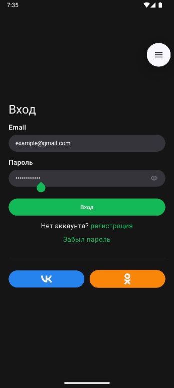

Тестовое задание

### Используемые технологии:
- Jetpack Compose
- Coroutines / Flow
- Dagger2 / Hilt
- Room
- Retrofit 2
- Navigation 3

---
## Экраны:
### Login
Имеет простую логику и реализован частично как stateful.

### Home
Имеет сложный state и поддерживает offline‑first (кеш Room). 
Навигация защищена от перехода без авторизации. 
CourseView содержит элементы с размытием заднего фона.

### Favorite
Не запрашивает новые данные, осуществляя фильтрацию в ViewModel.

---

<table>
  <tr>
    <td></td>
    <td></td>
  </tr>
</table>
